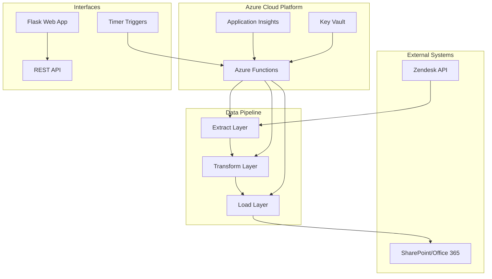
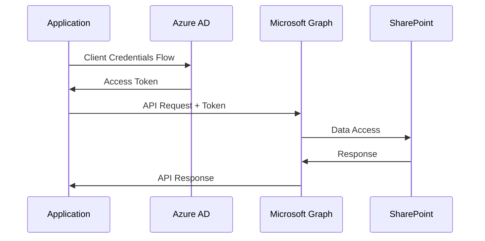

# Architecture Guide

## System Overview

The Daily Root Cause Analysis App implements a robust ETL (Extract, Transform, Load) pipeline that processes IT support tickets through multiple transformation stages to generate business intelligence reports.

## High-Level Architecture



## Data Pipeline Architecture

### Stage 1: Data Extraction (`extract.py`)

**Purpose**: Raw data ingestion from Zendesk API

**Technical Implementation**:

```python
# API Configuration
- Endpoint: https://{subdomain}.zendesk.com/api/v2/search.json
- Authentication: Token-based (email/token)
- Rate Limiting: 700 requests/minute (Zendesk limit)
- Pagination: Cursor-based with 500 records/page
```

**Data Processing**:

- **Temporal Filtering**: Previous 24 hours (midnight to midnight)
- **Group Filtering**: 16 approved IT support groups
- **Pattern Exclusion**: 25+ regex patterns for automated tickets
- **Custom Field Extraction**: Product and action taken fields
- **Schema Normalization**: Standardized output format

**Performance Characteristics**:

- Processing Time: 2-3 minutes for 500-2000 tickets
- Memory Usage: ~50MB peak
- Error Handling: Exponential backoff with 3 retry attempts

### Stage 2: Group-Based Transformation (`filter_groups.py`)

**Purpose**: Apply business rules for organizational mapping

**Transformation Logic**:

```python
# Group-to-Product Mapping Rules
mapping_rules = {
    'Equipment': ['Equipment', 'Equipment Waiting', 'mobile_device_new'],
    'UAP': ['Hartford UAP', 'UAP', 'automation_mobile_device_term'],
    'Fuze': ['Fuze'],
    'Network': ['Network']
}
```

**Business Rules**:

- Hierarchical group mapping to standardized categories
- Null value standardization (‘No Product’ → empty string)
- Organizational structure enforcement

### Stage 3: Classification Engine (`filter_subjects.py`)

**Purpose**: Intelligent ticket categorization using pattern recognition

**Algorithm Design**:

```python
# Multi-tier Classification Strategy
1. Action-based classification (priority 1)
2. Existing product validation (priority 2)  
3. Subject-based pattern matching (priority 3)
4. Default fallback handling (priority 4)
```

**Pattern Recognition Engine**:

- **Pattern Library**: 200+ regex patterns across 20+ categories
- **Context Awareness**: Multi-field analysis (subject + action + group)
- **Case Sensitivity**: Configurable case-insensitive matching
- **Performance**: O(n*m) complexity where n=tickets, m=patterns

**Key Categories**:

```python
categories = {
    'Infrastructure': ['ADUC', 'Azure AVD', 'Network', 'Drive Access'],
    'Business_Apps': ['HCHB', 'PCC', 'Workday', 'Forcura'],
    'Communication': ['Exchange', 'Teams', 'Fuze', 'MOBI'],
    'Hardware': ['Equipment', 'Printers'],
    'Administrative': ['UAP', 'Training', 'Documentation']
}
```

### Stage 4: Product Mapping (`map_products.py`)

**Purpose**: Standardize nomenclature across organizational systems

**Implementation**:

- **Lookup Table**: 100+ internal tag to business name mappings
- **Referential Integrity**: Maintains consistency across systems
- **Extensibility**: Easy addition of new product mappings

### Stage 5: Data Aggregation (`aggregate.py`)

**Purpose**: Generate business intelligence and statistical summaries

**Aggregation Algorithms**:

```python
# Primary Aggregation
daily_summary = df.groupby(['Date', 'Product']).agg({
    'Tickets': 'sum'
}).reset_index()

# Anomaly Detection
high_volume = df[df['Ticket_Count'] > 15]  # Threshold-based

# Statistical Analysis
- Daily totals by category
- Percentage distributions
- Trend analysis preparation
- Outlier identification
```

**Output Formats**:

1. **Summary Dataset**: Aggregated counts with daily totals
1. **Detailed Dataset**: Granular analysis for high-volume categories
1. **Formatted Reports**: Business-ready with spacing and formatting

### Stage 6: Format Transformation (`convert.py`)

**Purpose**: Convert data to enterprise-ready Excel format

**Features**:

- **Schema Preservation**: Maintains data integrity during conversion
- **Formatting Optimization**: Auto-adjusted column widths
- **Encoding Handling**: UTF-8 support for international characters
- **Validation**: Post-conversion data integrity checks

### Stage 7: Data Integration (`sharepoint_upload.py`)

**Purpose**: Enterprise data warehouse integration

**Integration Pattern**:

```python
# Upsert Strategy
1. Download existing SharePoint data
2. Identify new records by date comparison
3. Merge new data with historical records
4. Upload updated datasets
5. Create backup copies
```

**Enterprise Features**:

- **Microsoft Graph API**: Modern authentication and authorization
- **Incremental Loading**: Only processes new data to minimize conflicts
- **Version Control**: Automatic backup creation
- **Multi-sheet Management**: Handles complex Excel workbooks

## Technical Stack

### Core Technologies

- **Runtime**: Python 3.8+
- **Framework**: Flask (web interface), Azure Functions (serverless)
- **Data Processing**: Pandas, NumPy
- **Authentication**: MSAL (Microsoft Authentication Library)
- **File Processing**: OpenPyXL, CSV standard library

### Cloud Infrastructure

- **Compute**: Azure Functions (Consumption Plan)
- **Storage**: Azure Blob Storage (temporary files)
- **Monitoring**: Application Insights
- **Security**: Azure Key Vault, Managed Identity
- **Integration**: Microsoft Graph API

### Dependencies

```python
# Critical Dependencies
pandas>=2.2.3          # Data processing
msal>=1.31.1            # Microsoft authentication
office365>=0.3.15       # SharePoint integration  
requests>=2.32.3        # HTTP client
openpyxl>=3.1.5         # Excel file handling
flask                   # Web interface
azure-functions         # Serverless runtime
```

## Data Models

### Extraction Schema

```python
{
    "ticket_id": "integer",
    "subject": "string",
    "group_id": "integer", 
    "group_name": "string",
    "created_at": "timestamp",
    "custom_fields": [
        {
            "id": "integer",
            "value": "string"
        }
    ]
}
```

### Processed Schema

```python
{
    "product_service_desk_tool": "string",
    "action_taken": "string",
    "ticket_group": "string", 
    "ticket_subject": "string",
    "ticket_created_day": "integer",
    "ticket_created_month": "integer",
    "ticket_created_year": "integer",
    "tickets": "integer"
}
```

### Aggregated Schema

```python
{
    "date": "date",
    "product_category": "string",
    "ticket_count": "integer",
    "daily_total": "integer",
    "subjects": ["string"]  // For detailed analysis
}
```

## Performance Characteristics

### Scalability Metrics

- **Current Volume**: 500-2000 tickets/day
- **Processing Time**: 5-10 minutes end-to-end
- **Memory Usage**: Peak 150MB during aggregation
- **API Limits**: 700 requests/minute (well below Zendesk limits)

### Bottleneck Analysis

1. **API Rate Limiting**: Mitigated with batch processing and delays
1. **Pattern Matching**: O(n*m) complexity, optimized with early termination
1. **SharePoint Upload**: Network-dependent, includes retry logic
1. **Memory Usage**: Managed with streaming processing for large datasets

### Optimization Strategies

- **Batch Processing**: 500-record batches with pause intervals
- **Caching**: Regex compilation caching for pattern matching
- **Incremental Processing**: Only new data processed in SharePoint updates
- **Parallel Processing**: Potential for concurrent pattern matching

## Security Architecture

### Authentication Flow



### Security Controls

- **Token Management**: Automatic refresh with MSAL
- **Least Privilege**: Minimal required permissions for SharePoint access
- **Environment Variables**: Sensitive data stored in Azure Key Vault
- **Network Security**: HTTPS-only communication
- **Audit Logging**: Comprehensive activity logging

## Deployment Architecture

### Azure Functions Deployment

```yaml
# Function App Configuration
runtime: python
version: 3.9
plan: consumption
region: east-us-2
settings:
  - ZENDESK_API_TOKEN: <key_vault_reference>
  - CLIENT_ID: <key_vault_reference>
  - CLIENT_SECRET: <key_vault_reference>
```

### Monitoring and Observability

- **Application Insights**: Performance metrics and error tracking
- **Custom Metrics**: Pipeline stage completion times
- **Alerting**: Failed execution notifications
- **Dashboard**: Real-time processing status

## Error Handling and Resilience

### Failure Modes

1. **API Failures**: Zendesk service disruptions
1. **Authentication Errors**: Token expiration or permission changes
1. **Data Quality Issues**: Malformed tickets or missing fields
1. **Network Timeouts**: SharePoint connectivity issues

### Recovery Strategies

- **Exponential Backoff**: Automatic retry with increasing delays
- **Circuit Breaker**: Fail fast for sustained API failures
- **Graceful Degradation**: Partial processing when possible
- **Manual Recovery**: Web interface for manual pipeline triggers

## Future Architecture Considerations

### Scalability Enhancements

- **Event-Driven Architecture**: Real-time processing with Azure Event Grid
- **Microservices**: Decompose pipeline into independent services
- **Container Deployment**: Kubernetes for better resource management
- **Data Lake Integration**: Azure Data Lake for historical analytics

### Advanced Analytics

- **Machine Learning**: Replace regex patterns with trained models
- **Real-Time Dashboards**: Power BI integration for live reporting
- **Predictive Analytics**: Forecast ticket volumes and trends
- **Natural Language Processing**: Advanced text classification