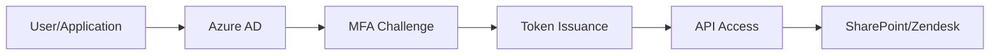

# Security Policy

## Security Overview

The Daily Root Cause Analysis App handles sensitive IT operational data and integrates with critical enterprise systems. This document outlines security policies, procedures, and best practices to ensure the confidentiality, integrity, and availability of the system and data.

## Threat Model

### Assets Protected

- **IT Support Ticket Data**: Sensitive operational information about internal systems and processes
- **Authentication Credentials**: API tokens, client secrets, and service account credentials
- **Business Intelligence**: Aggregated analytics and trend data
- **System Configuration**: Infrastructure and application configuration details

### Threat Actors

- **External Attackers**: Attempting to gain unauthorized access to enterprise data
- **Malicious Insiders**: Employees with legitimate access attempting unauthorized activities
- **Supply Chain**: Compromised dependencies or third-party services
- **Accidental Exposure**: Unintentional data leaks through misconfiguration

### Attack Vectors

- API credential compromise
- Injection attacks (SQL, NoSQL, command injection)
- Man-in-the-middle attacks on API communications
- Privilege escalation through misconfigurations
- Data exfiltration through compromised systems

## Security Architecture

### Authentication and Authorization

#### Multi-Factor Authentication



#### OAuth 2.0 Client Credentials Flow

```python
# Secure authentication implementation
import msal
from typing import Optional

class SecureAuthenticator:
    def __init__(self, client_id: str, client_secret: str, tenant_id: str):
        self.client_id = client_id
        self.client_secret = client_secret
        self.tenant_id = tenant_id
        self.app = self._create_msal_app()
    
    def _create_msal_app(self) -> msal.ConfidentialClientApplication:
        """Create MSAL application with security best practices."""
        authority = f"https://login.microsoftonline.com/{self.tenant_id}"
        return msal.ConfidentialClientApplication(
            client_id=self.client_id,
            client_credential=self.client_secret,
            authority=authority,
            token_cache=None  # No token caching for security
        )
    
    def get_access_token(self, scopes: list) -> Optional[str]:
        """Acquire access token with proper error handling."""
        try:
            result = self.app.acquire_token_for_client(scopes=scopes)
            if "access_token" in result:
                return result['access_token']
            else:
                logging.error(f"Authentication failed: {result.get('error_description')}")
                return None
        except Exception as e:
            logging.error(f"Authentication error: {e}")
            return None
```

#### Role-Based Access Control (RBAC)

**Application Registration Permissions**:

```json
{
    "requiredResourceAccess": [
        {
            "resourceAppId": "00000003-0000-0000-c000-000000000000",
            "resourceAccess": [
                {
                    "id": "7427e0e9-2fba-42fe-b0c0-848c9e6a8182",
                    "type": "Scope",
                    "value": "offline_access"
                },
                {
                    "id": "5f8c59db-677d-491f-a6b8-5f174b11ec1d",
                    "type": "Scope", 
                    "value": "Sites.ReadWrite.All"
                }
            ]
        }
    ]
}
```

**Principle of Least Privilege**:

- Application has minimum required permissions for SharePoint access
- No admin consent required for standard operations
- Regular permission audits and cleanup

### Data Protection

#### Data Classification

```
┌─────────────────┬──────────────────┬───────────────────┐
│ Classification  │ Data Types       │ Protection Level  │
├─────────────────┼──────────────────┼───────────────────┤
│ Internal        │ Ticket subjects  │ Encryption at rest│
│ Internal        │ Category data    │ Access controls   │
│ Confidential    │ API tokens       │ Key Vault storage │
│ Confidential    │ Client secrets   │ Encrypted secrets │
│ Restricted      │ System configs   │ Admin-only access │
└─────────────────┴──────────────────┴───────────────────┘
```

#### Encryption Standards

**Data in Transit**:

- TLS 1.2+ for all API communications
- Certificate pinning for critical endpoints
- HSTS headers for web interface

**Data at Rest**:

- Azure Storage encryption (AES 256)
- SharePoint encryption (Microsoft managed keys)
- No persistent local storage of sensitive data

**Key Management**:

```python
# Azure Key Vault integration
from azure.keyvault.secrets import SecretClient
from azure.identity import DefaultAzureCredential

class SecureConfigManager:
    def __init__(self, vault_url: str):
        credential = DefaultAzureCredential()
        self.client = SecretClient(vault_url=vault_url, credential=credential)
    
    def get_secret(self, secret_name: str) -> str:
        """Retrieve secret from Key Vault with proper error handling."""
        try:
            secret = self.client.get_secret(secret_name)
            return secret.value
        except Exception as e:
            logging.error(f"Failed to retrieve secret {secret_name}: {e}")
            raise SecurityError(f"Secret retrieval failed: {secret_name}")
```

### Network Security

#### API Security Controls

- **Rate Limiting**: Implemented at application and infrastructure levels
- **IP Whitelisting**: Restricted access from approved network ranges
- **WAF Protection**: Web Application Firewall for HTTP-based attacks
- **DDoS Protection**: Azure DDoS Protection Standard

#### Secure Communications

```python
# Secure HTTP client configuration
import requests
from requests.adapters import HTTPAdapter
from urllib3.util.retry import Retry

class SecureHTTPClient:
    def __init__(self):
        self.session = requests.Session()
        self._configure_security()
    
    def _configure_security(self):
        """Configure secure HTTP client settings."""
        # Disable insecure protocols
        self.session.verify = True
        
        # Configure retry strategy
        retry_strategy = Retry(
            total=3,
            backoff_factor=1,
            status_forcelist=[429, 500, 502, 503, 504],
        )
        
        adapter = HTTPAdapter(max_retries=retry_strategy)
        self.session.mount("https://", adapter)
        
        # Security headers
        self.session.headers.update({
            'User-Agent': 'RCA-App/2.1.0',
            'Accept': 'application/json',
            'Content-Type': 'application/json'
        })
```

## Vulnerability Management

### Security Scanning

#### Automated Security Checks

```yaml
# .github/workflows/security.yml
name: Security Scan

on:
  push:
    branches: [main, develop]
  pull_request:
    branches: [main]
  schedule:
    - cron: '0 2 * * 0'  # Weekly scan

jobs:
  security-scan:
    runs-on: ubuntu-latest
    
    steps:
    - name: Checkout code
      uses: actions/checkout@v3
    
    - name: Set up Python
      uses: actions/setup-python@v4
      with:
        python-version: 3.9
    
    - name: Install dependencies
      run: |
        pip install -r requirements.txt
        pip install bandit safety pip-audit
    
    - name: Run Bandit security linter
      run: bandit -r src/ -f json -o bandit-report.json
    
    - name: Check for known vulnerabilities
      run: safety check --json --output safety-report.json
    
    - name: Audit Python packages
      run: pip-audit --format=json --output=audit-report.json
    
    - name: Upload security reports
      uses: actions/upload-artifact@v3
      with:
        name: security-reports
        path: |
          bandit-report.json
          safety-report.json
          audit-report.json
```

#### Dependency Management

```bash
# Regular security updates
pip list --outdated
pip-audit --desc
safety check

# Update strategy
pip install --upgrade package_name
pip freeze > requirements.txt
```

### Vulnerability Response Process

#### Severity Classification

```
┌──────────┬─────────────────┬──────────────────┬─────────────────┐
│ Severity │ Response Time   │ Resolution Time  │ Escalation      │
├──────────┼─────────────────┼──────────────────┼─────────────────┤
│ Critical │ 1 hour          │ 24 hours         │ CISO immediate  │
│ High     │ 4 hours         │ 72 hours         │ Security team   │
│ Medium   │ 24 hours        │ 1 week           │ Dev team lead   │
│ Low      │ 1 week          │ Next release     │ Backlog         │
└──────────┴─────────────────┴──────────────────┴─────────────────┘
```

#### Incident Response

1. **Detection**: Automated scanning, manual reporting, third-party alerts
1. **Assessment**: Severity classification and impact analysis
1. **Containment**: Immediate steps to limit exposure
1. **Eradication**: Fix the vulnerability and remove threats
1. **Recovery**: Restore normal operations with monitoring
1. **Lessons Learned**: Post-incident review and process improvement

## Secure Development Practices

### Code Security Standards

#### Input Validation

```python
import re
from typing import Optional
from datetime import datetime

class InputValidator:
    """Secure input validation for API parameters."""
    
    @staticmethod
    def validate_date(date_string: str) -> bool:
        """Validate date input against injection attacks."""
        # Only allow ISO 8601 date format
        pattern = r'^\d{4}-\d{2}-\d{2}$'
        if not re.match(pattern, date_string):
            return False
        
        try:
            datetime.strptime(date_string, '%Y-%m-%d')
            return True
        except ValueError:
            return False
    
    @staticmethod
    def sanitize_filename(filename: str) -> str:
        """Sanitize filename to prevent path traversal."""
        # Remove path separators and dangerous characters
        safe_chars = re.sub(r'[^a-zA-Z0-9._-]', '', filename)
        return safe_chars[:100]  # Limit length
    
    @staticmethod
    def validate_api_token(token: str) -> bool:
        """Validate API token format."""
        # Check for minimum length and character set
        if len(token) < 32:
            return False
        return re.match(r'^[a-zA-Z0-9_-]+$', token) is not None
```

#### Secure Error Handling

```python
import logging
from typing import Any, Dict

class SecureLogger:
    """Security-conscious logging implementation."""
    
    def __init__(self, name: str):
        self.logger = logging.getLogger(name)
        
    def log_error(self, message: str, context: Dict[str, Any] = None):
        """Log errors without exposing sensitive information."""
        # Remove sensitive data from context
        safe_context = self._sanitize_context(context or {})
        
        self.logger.error(f"{message}", extra=safe_context)
    
    def _sanitize_context(self, context: Dict[str, Any]) -> Dict[str, Any]:
        """Remove sensitive information from log context."""
        sensitive_keys = ['password', 'token', 'secret', 'key', 'credential']
        
        safe_context = {}
        for key, value in context.items():
            if any(sensitive in key.lower() for sensitive in sensitive_keys):
                safe_context[key] = '[REDACTED]'
            else:
                safe_context[key] = str(value)[:100]  # Limit value length
        
        return safe_context
```

#### SQL Injection Prevention

```python
# Although this app doesn't use SQL directly, principles apply to any injection
import pandas as pd
from typing import List

def safe_data_filter(df: pd.DataFrame, column: str, values: List[str]) -> pd.DataFrame:
    """Safely filter DataFrame without injection risks."""
    # Validate column name against whitelist
    allowed_columns = ['date', 'category', 'group', 'subject']
    if column not in allowed_columns:
        raise ValueError(f"Column '{column}' not in allowed list")
    
    # Use pandas built-in filtering (no string concatenation)
    return df[df[column].isin(values)]
```

### Secrets Management

#### Environment Variable Security

```python
import os
from typing import Optional
import logging

class SecureConfig:
    """Secure configuration management."""
    
    def __init__(self):
        self._validate_environment()
    
    def _validate_environment(self):
        """Validate that required environment variables are set."""
        required_vars = [
            'ZENDESK_API_TOKEN',
            'CLIENT_ID', 
            'CLIENT_SECRET',
            'TENANT_ID'
        ]
        
        missing_vars = [var for var in required_vars if not os.getenv(var)]
        if missing_vars:
            raise SecurityError(f"Missing required environment variables: {missing_vars}")
    
    def get_secret(self, key: str) -> str:
        """Retrieve secret with proper error handling."""
        value = os.getenv(key)
        if not value:
            logging.error(f"Environment variable {key} not found")
            raise SecurityError(f"Required configuration missing: {key}")
        return value
    
    def get_optional_secret(self, key: str, default: str = None) -> Optional[str]:
        """Retrieve optional secret with default value."""
        return os.getenv(key, default)
```

#### Azure Key Vault Integration

```python
from azure.keyvault.secrets import SecretClient
from azure.identity import DefaultAzureCredential
from azure.core.exceptions import ResourceNotFoundError

class AzureKeyVaultManager:
    """Secure Azure Key Vault integration."""
    
    def __init__(self, vault_url: str):
        self.vault_url = vault_url
        self.credential = DefaultAzureCredential()
        self.client = SecretClient(vault_url=vault_url, credential=self.credential)
    
    def get_secret(self, secret_name: str) -> str:
        """Retrieve secret from Key Vault."""
        try:
            secret = self.client.get_secret(secret_name)
            return secret.value
        except ResourceNotFoundError:
            logging.error(f"Secret '{secret_name}' not found in Key Vault")
            raise SecurityError(f"Secret not found: {secret_name}")
        except Exception as e:
            logging.error(f"Key Vault access error for '{secret_name}': {e}")
            raise SecurityError("Key Vault access failed")
    
    def rotate_secret(self, secret_name: str, new_value: str):
        """Rotate secret in Key Vault."""
        try:
            self.client.set_secret(secret_name, new_value)
            logging.info(f"Secret '{secret_name}' rotated successfully")
        except Exception as e:
            logging.error(f"Secret rotation failed for '{secret_name}': {e}")
            raise SecurityError("Secret rotation failed")
```

## Compliance and Governance

### Regulatory Compliance

#### SOX Compliance (Sarbanes-Oxley)

- **Audit Trail**: Complete logging of all data processing activities
- **Data Integrity**: Checksums and validation for financial impact data
- **Access Controls**: Segregation of duties and approval processes
- **Change Management**: Version control and change approval for production releases

#### GDPR Considerations

- **Data Minimization**: Only collect necessary ticket metadata, no personal data
- **Purpose Limitation**: Data used only for IT operations analysis
- **Storage Limitation**: Data retention policies aligned with business needs
- **Data Subject Rights**: Procedures for data access and deletion requests

#### HIPAA Considerations

- **PHI Protection**: No processing of protected health information
- **Administrative Safeguards**: Security policies and procedures
- **Physical Safeguards**: Secure cloud infrastructure
- **Technical Safeguards**: Encryption and access controls

### Data Governance

#### Data Classification

```python
from enum import Enum
from typing import List, Dict

class DataClassification(Enum):
    PUBLIC = "public"
    INTERNAL = "internal" 
    CONFIDENTIAL = "confidential"
    RESTRICTED = "restricted"

class DataGovernor:
    """Implement data governance policies."""
    
    CLASSIFICATION_RULES = {
        'ticket_subject': DataClassification.INTERNAL,
        'category_data': DataClassification.INTERNAL,
        'api_tokens': DataClassification.RESTRICTED,
        'aggregated_metrics': DataClassification.INTERNAL,
        'system_configs': DataClassification.CONFIDENTIAL
    }
    
    def classify_data(self, data_type: str) -> DataClassification:
        """Classify data according to governance policies."""
        return self.CLASSIFICATION_RULES.get(data_type, DataClassification.CONFIDENTIAL)
    
    def get_retention_period(self, classification: DataClassification) -> int:
        """Get data retention period in days."""
        retention_periods = {
            DataClassification.PUBLIC: 2555,      # 7 years
            DataClassification.INTERNAL: 2190,    # 6 years  
            DataClassification.CONFIDENTIAL: 1825, # 5 years
            DataClassification.RESTRICTED: 1095   # 3 years
        }
        return retention_periods[classification]
```

### Audit and Monitoring

#### Security Event Logging

```python
import json
from datetime import datetime
from typing import Dict, Any

class SecurityAuditLogger:
    """Comprehensive security event logging."""
    
    def __init__(self, log_file: str = 'security_audit.log'):
        self.log_file = log_file
    
    def log_authentication_event(self, user_id: str, success: bool, details: Dict[str, Any]):
        """Log authentication attempts."""
        event = {
            'timestamp': datetime.utcnow().isoformat(),
            'event_type': 'authentication',
            'user_id': user_id,
            'success': success,
            'source_ip': details.get('source_ip', 'unknown'),
            'user_agent': details.get('user_agent', 'unknown')
        }
        self._write_audit_log(event)
    
    def log_data_access(self, user_id: str, resource: str, action: str):
        """Log data access events."""
        event = {
            'timestamp': datetime.utcnow().isoformat(),
            'event_type': 'data_access',
            'user_id': user_id,
            'resource': resource,
            'action': action
        }
        self._write_audit_log(event)
    
    def _write_audit_log(self, event: Dict[str, Any]):
        """Write audit event to secure log file."""
        try:
            with open(self.log_file, 'a') as f:
                f.write(json.dumps(event) + '\n')
        except Exception as e:
            # Use system logger as fallback
            logging.error(f"Audit logging failed: {e}")
```

## Incident Response

### Security Incident Classifications

#### Classification Matrix

```
┌─────────────┬─────────────────┬──────────────────┬─────────────────┐
│ Type        │ Examples        │ Initial Response │ Investigation   │
├─────────────┼─────────────────┼──────────────────┼─────────────────┤
│ Data Breach │ Unauthorized    │ Isolate system   │ Forensic        │
│             │ data access     │ Notify CISO      │ analysis        │
├─────────────┼─────────────────┼──────────────────┼─────────────────┤
│ Malware     │ Infected system │ Quarantine       │ Malware         │
│             │ or files        │ Scan network     │ analysis        │
├─────────────┼─────────────────┼──────────────────┼─────────────────┤
│ Phishing    │ Credential      │ Reset passwords  │ Email forensics │
│             │ compromise      │ Revoke tokens    │ Impact assess   │
├─────────────┼─────────────────┼──────────────────┼─────────────────┤
│ DoS/DDoS    │ Service         │ Traffic analysis │ Attack pattern  │
│             │ unavailability  │ Apply filtering  │ analysis        │
└─────────────┴─────────────────┴──────────────────┴─────────────────┘
```

### Response Procedures

#### Immediate Response (0-1 hours)

1. **Incident Detection and Reporting**
- Automated alerting through monitoring systems
- Manual reporting via security hotline
- Triage and initial classification
1. **Immediate Containment**
- Isolate affected systems
- Revoke compromised credentials
- Preserve evidence for investigation
1. **Stakeholder Notification**
- CISO and security team
- Application owner
- Business stakeholders (if business impact)

#### Investigation Phase (1-24 hours)

1. **Evidence Collection**
- System logs and audit trails
- Network traffic analysis
- User activity logs
- Configuration snapshots
1. **Impact Assessment**
- Data exposure evaluation
- System compromise scope
- Business impact analysis
- Compliance implications
1. **Root Cause Analysis**
- Attack vector identification
- Timeline reconstruction
- Vulnerability analysis
- Process failure review

#### Recovery and Lessons Learned (24+ hours)

1. **System Recovery**
- Secure system restoration
- Validation of system integrity
- Monitoring for continued threats
- Performance verification
1. **Process Improvement**
- Security control updates
- Process documentation updates
- Training requirements
- Technology improvements

## Security Contacts

### Reporting Security Issues

#### Internal Reporting

- **Security Team**: security@company.com
- **CISO Office**: ciso@company.com
- **Emergency Hotline**: +1-555-SECURITY
- **Incident Portal**: https://security.company.com/incident

#### External Vulnerability Disclosure

- **Responsible Disclosure**: security-disclosure@company.com
- **Response SLA**: 5 business days acknowledgment
- **Resolution Timeline**: 90 days for non-critical, 30 days for critical
- **Bug Bounty Program**: https://bugbounty.company.com

### Security Team Contacts

|Role              |Contact                  |Responsibilities              |
|------------------|-------------------------|------------------------------|
|CISO              |ciso@company.com         |Overall security governance   |
|Security Architect|security-arch@company.com|Security design and review    |
|Incident Commander|incident-cmd@company.com |Incident response coordination|
|Compliance Officer|compliance@company.com   |Regulatory compliance         |

## Security Training

### Required Training

- **Security Awareness**: Annual training for all developers
- **Secure Coding**: Quarterly training for development team
- **Incident Response**: Semi-annual tabletop exercises
- **Compliance**: Role-specific training based on data handling

### Resources

- **Security Wiki**: https://wiki.company.com/security
- **Training Portal**: https://learning.company.com/security
- **Security Tools**: https://tools.company.com/security
- **Threat Intelligence**: https://threat-intel.company.com

-----

**Document Classification**: Confidential - Internal Use Only  
**Last Updated**: December 15, 2024  
**Document Owner**: Security Team  
**Review Cycle**: Quarterly